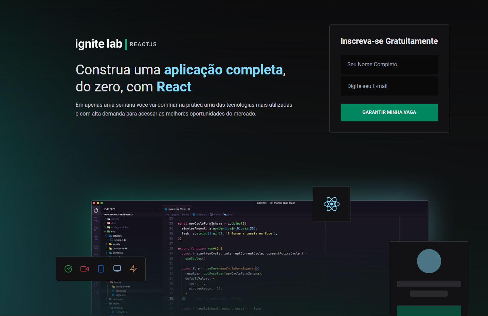

<h3 align="center">
   
</h3>

<h1 align="center">Projeto-Ignite-Lab</h1>

 

 

ÍNDICE...

<a href="#sobre-o-projeto">Sobre</a> • 
<a href="#Imagem">Imagem</a> • 
<a href="#Tecnologias-">Tecnologias</a> • 
<a href="#Ferramentas">Ferramentas</a>

<h1></h1>

<h3 align="center">Sobre o Projeto</h3>

<h4 align="center">🚀Plataforma de aulas digitais baseada no FrameWork da Rocket Seat🚀</h4>

 

<h1 align="center">Imagem</h1>
<h1 align="center">
   
</h1>

  ### Tecnologias 🚀

  As seguintes ferramentas foram usadas na construção do projeto:

  - [x] **JavaScript**
  - [x] **Vite**
  - [x] **TypeScript**
  - [x] **Graphql**

  #### Ferramentas

  - [**VS CODE**](https://code.visualstudio.com/)
  - [**GraphCMS**](https://app.graphcms.com/)
  - [**Vercel**](https://www.vercel.com/)

 
 
  
Made with 💜 by FELIPE HOLANDA 👋🏻 [See my Linkedin](https://www.linkedin.com/in/felipe-holanda-de-freitas-3a91281a2/)

   
---------------------------END------------------------

